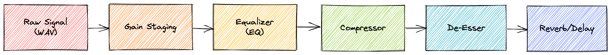
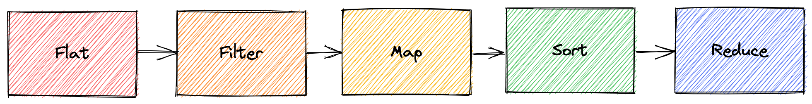

# Thinking Front End

## Table of Contents

1. System Design
2. Components
3. Data Management
4. Patterns

## System Design

Use RADAR (Requirements, Architecture, Data Model, API, The Rest). Can be applied to problems of any size, from whole systems to individual components!

1. Requirements - Understand all the requirements before you start.
2. Architecture - Outline the pieces you're going to build. Draw it!
3. Data Model - What is the data? Where is the data stored? Where will it be passed?
4. API - How will someone/something else consume this?
5. The Rest - ...

### The Rest

- UX
- Performance
- a11y
- i18n
- Devices
  - Responsiveness
  - Progressive enhancement/graceful degradation
- Security
- Progressive web app/service workers
- Metrics
- Monitoring

## Components

### Smart vs Dumb

[Smart Component](examples/001.jsx)

[Smart + Dumb Components](examples/002.jsx)

#### Why?

Makes your components easier to:

1. Test
2. Reuse
3. Compose
4. Read
5. Maintain
6. Refactor
7. Remove

## Data Management

### Vocal Processing

### Array Processing

## Patterns

[Patterns.dev](https://patterns.dev)
