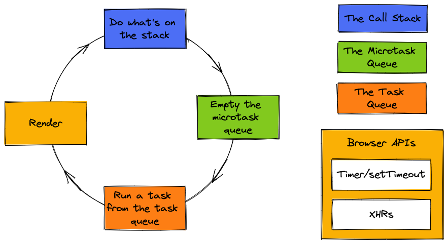

# JavaScript Event Loop

## Race Condition?

```javascript
console.log('First');

setTimeout(() => console.log('Second'), 1000);

const timestamp = new Date();
while (new Date() - timestamp < 1000) {}

console.log('Third');
```

Both the `Second` and the `Third` console logs are supposed to wait 1 second before displaying. So is there a race condition?

Or is there a way to know which one will come first?

### Answer

```
First
Third
Second
```

This will be the order _every single time_. There is no race condition. Why not?

## Event Loop



## Example

[Let's do a harder example!](examples/example.html)
