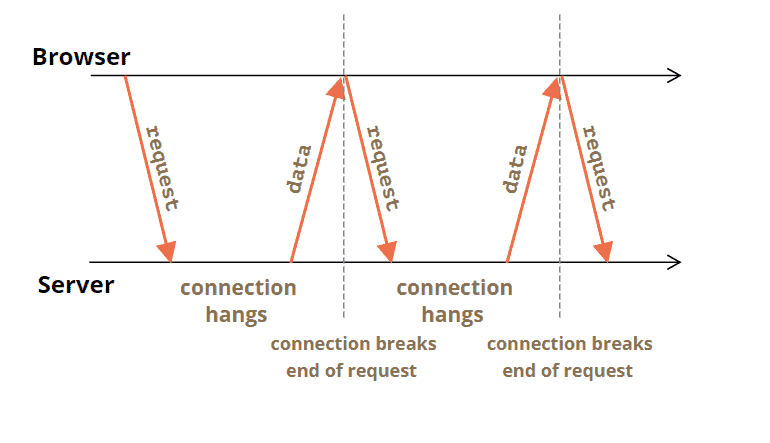

# Short Polling

This one is the easiest approach. All client-side. We're just gonna spam the server.
## Breakdown
1. Request your data from client-side
2. Wait a little bit
3. Request your data from client-side
4. Wait a little bit
5. Request your data from client-side
6. Set off a security/excess resource alert and have Ben Doherty come talk to you

## Pros
- You don't have to touch anything but front-end code
- Fastest to implement, usually don't have to get approval for other teams

## Cons
- Spam. Each new incoming connection has to be established, go through handshakes, a query fires for some data, a response is generated, the connection needs to get closed and resources need to get cleaned up. Gross.
- Most of the time you're just doing this for an empty response.
- Data updates have no relation to your poll timing so if you miss it by a second you're just sitting around till the next poll with no update

## Exercise
Try implementing the service calls to fetch activities and add a new activity in the `useActivitiesApi` hook. The hook automatically calls fetchActivities every 10 seconds but you can change the time interval to whatever
* run server using `node 2022-10-11-real-time-data-updates/backend/server.js`
* [UI component](examples/ActivityFeedPolling.jsx) - preview this to test your changes. Remember to pass the useActivitiesApi hook `ActivityApiPath.ShortPolling` as a param.
* [hook containing api calls](examples/utils/use-activities-api.ts) - follow TODOs in this file to set up api requests
