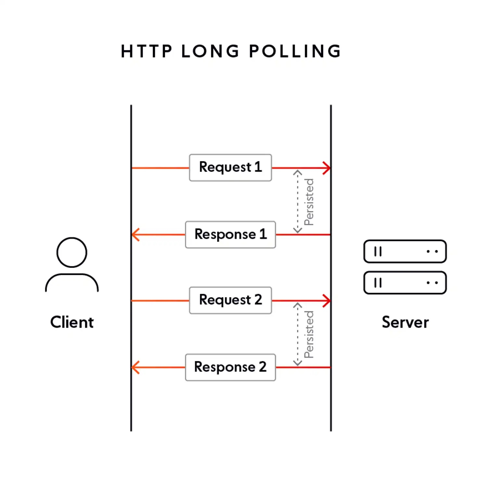

# Long Polling

Second easiest, requires us to mess with the service. We request once and the server stalls till it has something to tell us or hits a timeout.
## Breakdown
1. Request your data from client-side
2. Server either resonds if it has an update or keeps connection open till update or timeout 
3. Requeue your request from client-side

## Pros
- Waaaaay fewer request, reduced traffic footprint.
- Can't really miss updates easily. Maybe in the fraction of time before you requeue requests, but there's no arbitrary interval to worry about.
- Your client code will only be triggered on updates and timeouts.
- Best option for traditional client-server model.
- Works on gross browsers like Edge.

## Cons
- Still kinda expensive though. These days services are priced on up-time and now something has to stay awake to monitor your connection and send a response whenever it gets an update.
- Unidirectional. You can't really tell the server stuff while the connection is open.
- Lost connections are annoying. On mobile devices there are quick switches between WiFi and cell networks, how do we restablish connection in that case?

## Exercise
Try implementing long polling by updating the getActivitiesLongPollHandler in `activitiesController`. It should be able to update whoever calls the service if a new activity gets added, otherwise return current existing activities if it hits a max timeout.
* run server using `node 2022-10-11-real-time-data-updates/backend/server.js`. Note: you have to restart the server if you make any changes to `server.js` or `activitiesController.js`.
* [UI component](examples/ActivityFeedPolling.jsx) - preview this to test your changes. Remember to pass the useActivitiesApi hook `ActivityApiPath.LongPolling` as a param.
* [hook containing api calls](examples/utils/use-activities-api.ts)
* [activity api controller](backend/activitiesController.js) - follow TODOs for `getActivitiesLongPollHandler`
