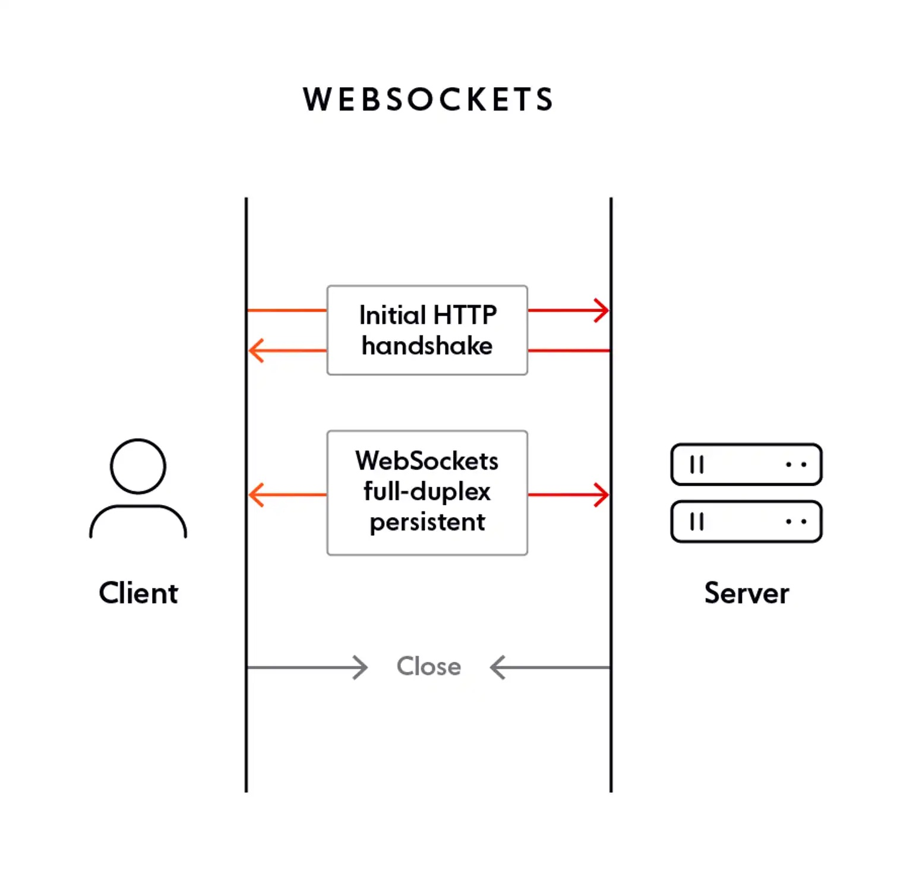

# Websockets

Pretty fancy. Pros of long-polling but with a fraction of the resource footprint. Rather than going the http route where any data exchange has to be framed with a ton of handshaking, verification and context data, websocket protocol establishes a direct connection during the initial request handshake. After that all data frames can be sent BI-DIRECTIONALLY with essentially no overhead.

## Breakdown
1. Open a websocket connection
2. Listen for changes or send messages, idk, whatever you want

## Pros
- Really, actually real time
- Bi-directional. Send a thank you message to the server after getting some updates.
- Cheaper than long-polling
- People tell me it's great for security, something about an origin-based security model, I dunno what that even means, it's probably great.

## Cons
- Not worth it if you don't need real time data. Like if your short-polling once an hour, keep the short poll.
- Older browsers don't support it, and shockingly IE11 and legacy Edge are still out there.

## Exercise
Try implementing our activities websocket handler. It should send current activities to the front end on connect and it should send a new list of activities to the front end whenever an activity is added.
* run server using `node 2022-10-11-real-time-data-updates/backend/server.js`. Note: you have to restart the server if you make any changes to `server.js` or `activitiesController.js`.
* [UI component](examples/ActivityFeedWS.jsx) - preview this to test your changes. Follow TODO to handle messages from server.
* [activity api controller](backend/activitiesController.js) - follow TODOs for `wsActivitiesHandler`
