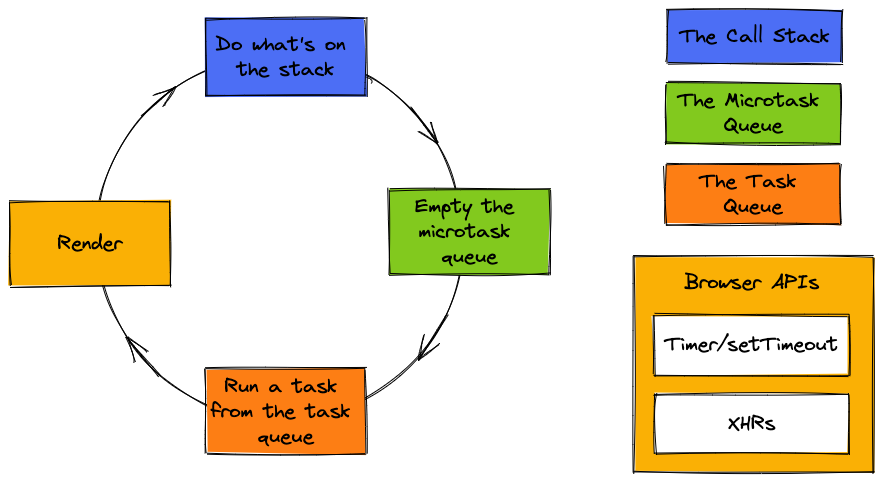

# Web Workers

## Event Loop Review



TLDR:
* Javascript-y stuff goes on call stack
* Non-Javascript-y stuff goes on task and microtask queues
* Event loop manages execution order between the 3


## What If I Wanna Do Computation Heavy JS Stuff?
Typically we want heavy computation to be handled by services, but sometimes its unavoidable in the front end. So how do we mimic multi-threading? Enter web workers!

## What's a Web Worker?
A little process running on a background thread, separate from your browser window thread.

### Key traits:
* Can't react with the DOM - runs in  a different global context
* Communicates with the main thread via messaging.
* Can scale up by spinning up more workers, as long as they're hosted within the same origin as the parent page.
* Data isn't shared, it's copied. The messaging protocol doesn't support functions, but it supports most objects. However, those objects aren't handed off between threads, a clone is just made on the recieving end since

### Anatomy
1. How do we make one? The Worker constructor with the file containing the code we wanna run passed in
```javascript
   const worker = new Worker('worker.js');
```
2. Send messages from worker to main or main to worker
```javascript
    // In main:
    worker.postMessage('Hello there!');


    // In worker
    this.postMessage('General Kenobi!');
```

3. Receive messages from worker in main or from main in worker
```javascript
    // In main:
    worker.addEventListener('message', function(event) {
        console.log(event.data); // message contents accessed on data attribute
    });

    // In worker
    this.addEventListener('message', function(event) {
        console.log(event.data); // message contents accessed on data attribute
    });
```

4. Wanna import scripts in your worker threads? Cool, they have access to a global function called importScripts:
```javascript
   importScripts('some-other-script.js');  
```

5. Done with your biz?
```javascript
    // In main:
    worker.terminate();

    // In worker:
    this.close();
```

## Common Use Cases
* Fancy animations (calculating position values, not actual animation execution)
* Big math, like big matrix multiplication tables
* Sequencing problems in biochem that require updates to big data sets on input of some previous table value
* Polling urls in the background
* Image processing and filtering
* Processing a lot of text data (syntax highlighting, spell checking, word count, etc)

## Example
Let's see it in action!
* [No web worker](examples/no-web-worker/main.js)
* [Web worker](examples/web-worker/main.js)

## Bonus
[Check out this cool projet that's trying to offload dependency modules into workers using a loader prefix](https://github.com/developit/workerize-loader)