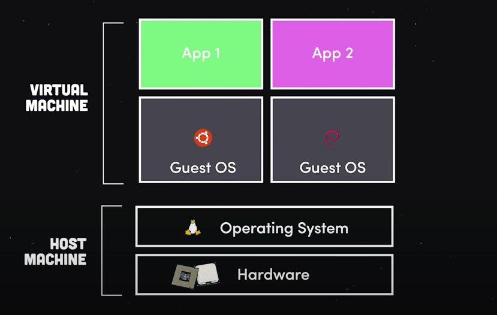
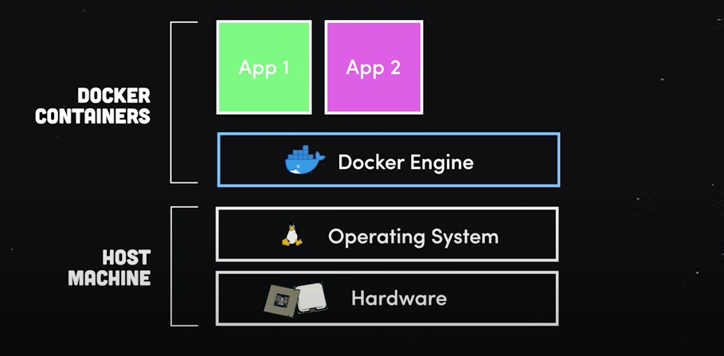

# Docker
im·pos·tor syn·drome (noun): fear of being exposed for not knowing Docker

## History

### In-House Servers
Services, apps, databases, it's all just some computer running somewhere.
If you ever wanted to provide any of these things you had to set up your own infrastructure

### Cloud Computing
In comes cloud computing. We'll run the computers, you essentially rent them. How can that earn money though?

B2B company needs servers with massive processing power and memory, mom and pop company needs a tiny place to host their locally accessed site.

Do you make servers of various capabilities? Turn them on when someone explicitly buys time on them? What if they don't use them to capacity? If they randomly scale up do you have to build more machines to that spec? If the contract ends and nobody needs this much power do you scrap it or shelf it or what?

Virtualization makes this model profitable by allowing full resource utilization.

TLDR (gross oversimplification): virtualization lets you pool hardware and subdivide it into "fake" computers.

Problem? Each VM is its own little fake computer and needs an OS. Operating systems are massive and resource intensive so this requirement makes everything way more expensive and chunky.

### Docker
Enter Docker! Software that lets you package your app and its dependencies into little, lightweight containers and virtualizes the operating system instead of only virtualizing hardware.

All apps and containers run on a single kernel, way faster and more efficient.

You get:
- consistency: you're setting up containers that include everything your app needs to run the exact same way in any environment. No more "it works on my machine"
- cost savings: no OS = way leaner, less uptime, less resources
- deployment speed: don't have to wait for a VM's OS to install and boot when provisioning a new instance.

## Anatomy
Three basic components you need to know:
1. Dockerfile: A template that tells Docker how to build an image.
   [Docker File Format Reference](https://docs.docker.com/engine/reference/builder/)
2. Image: A compiled snapshot of your software and all its dependencies, down to the OS level. This image is IMMUTABLE. Wanna change it? Gotta create a new one.
3. Container: a live running instance of your image.

## Useful commands

- docker build -t name dir
- docker images | grep name
- docker run containerId/tag 
- docker ps

## Exercise
* [Dockerize this API and consume it from your react app](exercise/dockerized-api)